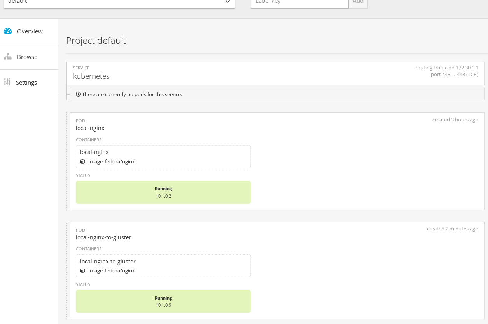

## Example 1: Deploy NGINX application using manually mounted GlusterFS volume from Atomic RHEL Host
---

**Summary**: 

At this point, all [environment assumptions](..) are met, and we have a Gluster Cluster running on separate hosts (gluster1.rhs and gluster2.rhs for this example).  We also installed and mounted the Gluster Volumes on our Atomic RHEL hosts (myVol1 and myVol2).  We will use the myVol1 in this example to show a simple pod that uses Distributed Storage.  To take advantage of the DFS we will create a fuse mount to the GlusterFS servers called /mnt/myVol1 which will then be used as our hostPath in our pod definition.  This could be utilized as potential method or even work around for containers that need Distributed Storage.

_Note: This method may be a potential use case and beneficial in certain situations, but it is not recommended to by-pass the volume plugins built into OpenShift as it would require this manual mount to exist on all nodes.  This is just a building block example to show the relationship between gluster and atomic hosts as well as a work around if glusterfs plugin was temporarily unavailable or malfunctioning.  You can [skip](../nginx_gluster_plugin) this example if you are only interested in the volume Plugin scenarios_ 

- To prepare for this example, we will navigate on our Atomic Host to the already mounted Gluster Volume - which is located at /mnt/myVol1 for our example.

        cd /mnt/myVol1
        mkdir glusterfs-nginx-atomichost-mount

        cd glusterfs-nginx-atomichost-mount
        ls
        [root@ose2 myVol1]# ls
        glusterfs-nginx         glusterfs-nginx-pvc  test1  test3
        *glusterfs-nginx-atomichost-mount*  helloworld.html      test2

- Now we can deploy our [pod configuration file](local-nginx-gluster-pod.json) that will utilize this host mount to gluster to serve the web pages.

*local-nginx-gluster-pod.json*

        {
            "apiVersion": "v1",
            "id": "local-nginx-to-gluster",
            "kind": "Pod",
            "metadata": {
                "name": "local-nginx-to-gluster"
            },
            "spec": {
                "containers": [
                     {
                         "name": "local-nginx-to-gluster",
                         "image": "fedora/nginx",
                         "volumeMounts": [
                             {
                                 "mountPath": "/usr/share/nginx/html/test",
                                 "name": "localvol"
                             }
                         ]
                     }
                ],
                "volumes": [
                    {
                         "name": "localvol",
                         "hostPath": {
                            "path": "/mnt/myVol1/glusterfs-nginx-atomichost-mount"
                         }
                    }
                ]
            }
        }

_Under volumeMounts_

        mountPath: /usr/share/nginx/html/test        This is the local container directory that will be mapped to the actual storage path (so from container, this path will be created)
        name:      localvol                          This is the name you give to the mount volume and it should match any volumes listed below in the volume section
        

_Under volumes_
      
        name:        nginxglustervol     matches name: nginxglustervol from volumeMounts
        hostPath:                        This is one of the acceptable values for a volume plugin, this value means it will use a local path on the host
        path:        /mnt/mypath         This is the actual path on the host that you want to map to, for our example, we mapped to our existing glusterfs hosted mount 

- Use the OpenShift Console (oc) to deploy the pod

        oc create -f local-nginx-gluster-pod.json

        [root@ose1 nginx_gluster_host]# oc create -f local-nginx-gluster-pod.json 
        pods/local-nginx 

- After a few minutes (this may vary), check and make sure the pod is running

        oc get pods

        [root@ose1 nginx_gluster_host]# oc get pods 
        NAME                     READY     STATUS    RESTARTS   AGE 
        local-nginx              1/1       Running   0          3h 
        local-nginx-to-gluster   1/1       Running   0          33s 

- You should now also see the pod running in your OpenShift Console web Interface  (https://your master host:8443/console)  (user:  `admin`  passwd: `admin`)

- From the OpenShift Console, Note the “IP on node” and “Node” values, which will tell you what ip and node the nginx application is running on.

- Create a sample html page to serve in the /mnt/gvol1/glusterfs-nginx-atomichost-mount  (mounted path) directory.  SSH to the Atomic Host node where the nginx application is running and issue the following command

      From the Atomic Host where the Container is running

        echo “This is being served from GlusterFS using manually created fuse mount to Gluster from the Atomic RHEL host using hostPath in the configuration...GlusterFS”  >> /mnt/gvol1/glusterfs-nginx-atomichost-mount/helloworld.html  

*alternatively, since this is mapped to gluster, you could have created this file directly on gluster or from any of the gluster volume mounts available to you, see below from one of the gluster clustered servers.*

      From one of the Gluster cluster hosts:

	
        [root@gluster1 glusterfs-nginx-atomichost-mount]# ls 
        helloworld.html 

- SSH into the node where the container is running (remember the details from the OpenShift Console Web GUI) and using the container_id obtained from “docker ps” command, jump into the container shell and then we will explore what we have.

      From the Atomic Host Where the Container is running:

        docker ps

        [root@ose2 myVol1]# docker ps 
        CONTAINER ID        IMAGE                         COMMAND             CREATED             STATUS              PORTS               NAMES 
        8dda35c5f9ad        fedora/nginx                  "/usr/sbin/nginx"   6 minutes ago       Up 6 minutes                            k8s_local-nginx-to-gluster.38f555f1_local-nginx-to-gluster_default_ca995463-45e8-11e5-ae70-52540008f001_2135479e   

        docker exec -it 8dda35c5f9ad bash

        [root@ose2 gvol1]# docker exec -it 8dda35c5f9ad bash 
        bash-4.3#

     From the Container:

        bash-4.3#
        bash-4.3# cd /usr/share/nginx/html/test/ 
        bash-4.3# ls 
        helloworld.html 
        
     
     Back to the Atomic Host:

        [root@ose2 /]# cd /mnt/myVol1
        [root@ose2 myVol1]# ls
        glusterfs-nginx-atomichost-mount

        [root@ose2 myVol1]# cd glusterfs-nginx-atomichost-mount/
        [root@ose2 glusterfs-nginx-atomichost-mount]# ls
        helloworld.html

              
*Notice when we go to our mounted nginx root test directory, we can now see all the contents of our GlusterFS Storage mount, including the directory we created `glusterfs-nginx-atomichost-mount`*

*Notice we also see our `helloworld.html` file that we created within that directory*

- Enter a simple curl command from the container to serve the page

        curl http://10.1.0.9/test/helloworld.html

        bash-4.3# curl http://10.1.0.9/test/helloworld.html 
        This is being served from GlusterFS using manually created fuse mount to Gluster from the Atomic RHEL host using hostPath in the configuration...GlusterFS 

===

[Main List](../)  |  [Next](../nginx_gluster_plugin)

===

